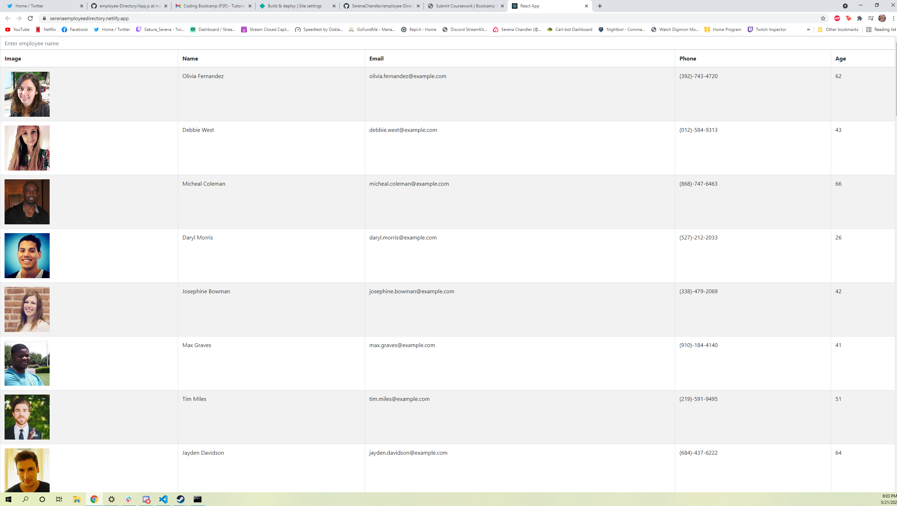
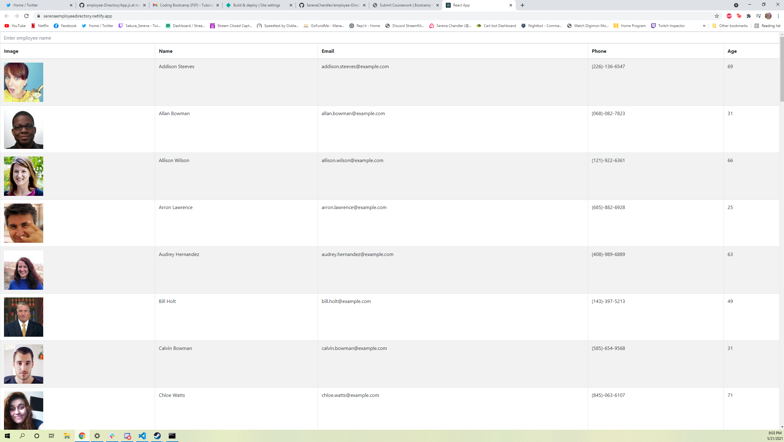
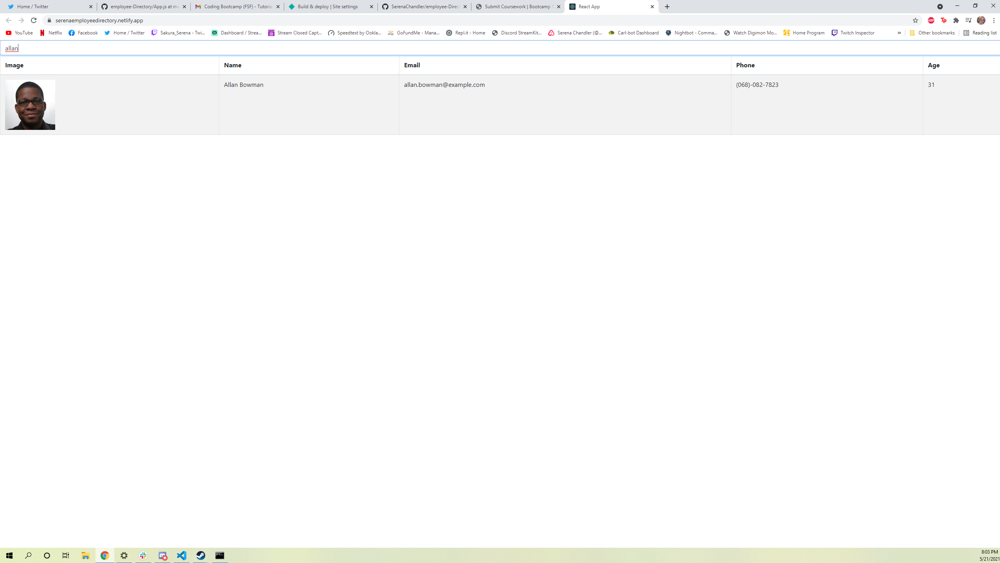

# Assignment Summary

This application is a directory of random people, with the ability to search for people by name, and sort the list by first name

## Built with

-React

-React-bootstrap

## Site Previews

How the site looks upon loading in

The site can be sorted by first name

Individuals can be searched for



## Code Snippets

The code that allows users to search for employees, by tracking their inputs and using an onChange method
```
 const handleInputChange = (event) => {
    const { value } = event.target;
    const filteredEmployees = ogResults.filter((employee) => {
      return employee.name.first
        .toLowerCase()
        .concat(" ", employee.name.last.toLowerCase())
        .includes(value);
    });
    console.log(value);
    setResults(filteredEmployees);
    setEmployeeName(value);
  };
```

An example of react-bootstrap being implemented to create a table 
```
return (
    <div className="App">
      <Searchbar
        handleInputChange={handleInputChange}
        employeeName={employeeName}
      />
      <Table striped bordered hover>
      <EmployeeHeader sortEmployees={sortEmployees} />
      
      <tbody>
      {results.map((user) => (
        <Employee
          picture={user.picture.large}
          name={user.name.first + " " + user.name.last}
          age={user.dob.age}
          email={user.email}
          phone={user.phone}
        />
      ))}
  </tbody>

</Table>
    </div>
  );
```

## My Links

[GitHub](https://github.com/SerenaChandler)

[repo](https://github.com/SerenaChandler/employee-Directory)

[deployed app](https://serenaemployeedirectory.netlify.app/)